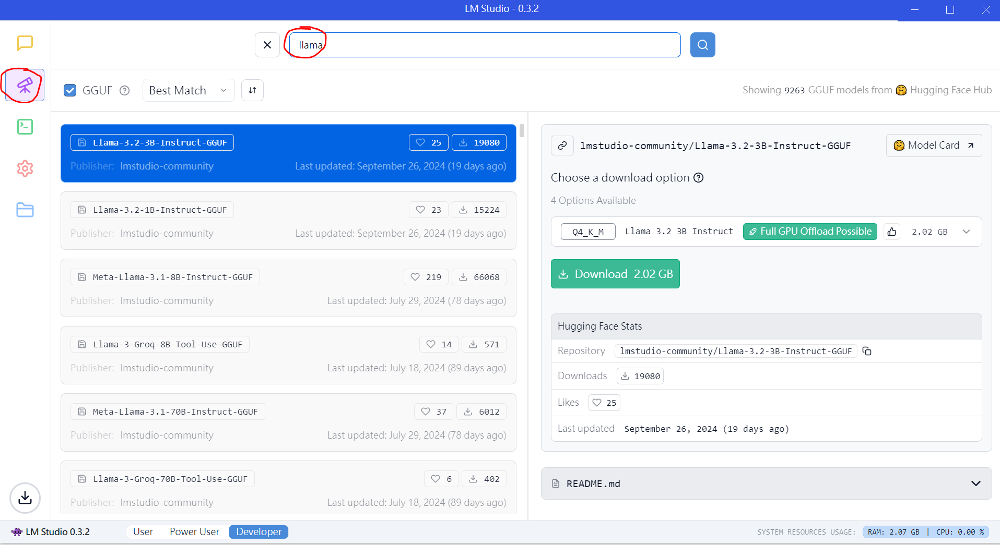

## 快速开始

### LM Studio
[通过 https://lmstudio.ai/ 下载对应系统的LM Studio](https://lmstudio.ai/)。


### 下载需要测试的大模型

你可以输入一些你希望测试的大模型集合来测试它们

### 开启服务

加载你刚刚下载好的模型

开启服务并且输入一些prompt(可空白)

### 代码LM Studio
请打开 LLM.ipynb, 下面这段代码借助openai API帮助链接代码和LM Studio Server
```python
from openai import OpenAI
client = OpenAI(base_url="http://localhost:1234/v1", api_key="not-needed")
```

下面这段代码是openai标准的completion的调用结构，我们借用于本地
```python
        completion_NuminaMath = client.chat.completions.create(
        model="lmstudio-community/reach-vb/NuminaMath-7B-TIR-Q8_0-GGUF/numinamath-7b-tir-q8_0.gguf", 
        messages=[
        {"role": "system", "content": tmp_question},
   
          ],
          temperature=0.7,
)
```
你需要指定模型类型(你成功加载到LM Studio本地的那些)，
以及输入内容，在LLM.ipynb，我以test_data.jsonl的数学问题作为例子
LLM生成的结果会保存在
```python
completion_NuminaMath.choices[0].message.content
```